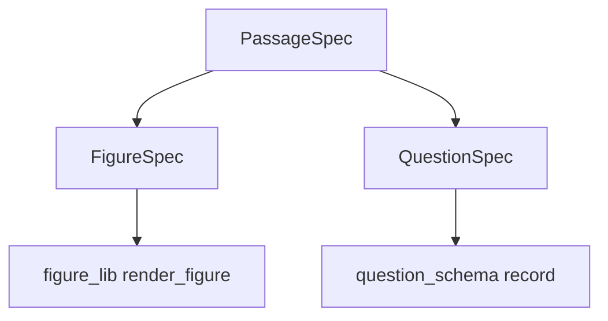

# MCAT Longform Question Authoring Framework

This document (1) distills the format of longform questions already present in this
project's corpus — especially the **actual MCAT practice-test passages** extracted from
`images/` — and (2) specifies a reusable, machine-checkable framework for writing one.

---

## 1. The three longform formats in this corpus

| Format | Where it lives | Anatomy |
|---|---|---|
| **A. MCAT practice-test passage** (the reference format) | [`extracted/images_extracted.json`](../extracted/images_extracted.json) | `Passage N (Questions X-Y)` header → 2–4 paragraph passage (context → methods → results) → 1–3 Figures/Tables → 4–7 MCQs |
| **B. ESSAY concept check** | [`workspace/generated_essay.jsonl`](../workspace/generated_essay.jsonl) | `prompt` (open-ended) + `model_answer` (2–5 sentences) + `key_points` (3–5 rubric bullets) + `difficulty` |
| **C. SCENARIO long question** | [`workspace/generated_scenario.jsonl`](../workspace/generated_scenario.jsonl) | `scenario` (research/experimental paragraph) + 3–4 MCQs, each `{question, options[4], correct, explanation}` |

The framework targets **format A** — the authentic practice-test passage — and aligns it
with the project's [`question_schema.json`](../question_schema.json) and
[`figure_lib.py`](../figure_lib.py).

---

## 2. Quantitative profile of the reference passages (from the extracted test)

Grounding numbers pulled from the 230 extracted questions:

| Section | Total Q | Passages | Discrete Q | Questions / passage |
|---|---|---|---|---|
| Chem/Phys | 59 | 9 | 19 | 4–5 (e.g. 1–4, 5–9, 18–21, 30–33, 47–51, 52–56) |
| CARS | 53 | 8 | 7 | 5–7 (e.g. 1–7, 8–12, 13–19, 20–25, 26–30, 31–36, 37–42, 43–47) |
| Bio/Biochem | 59 | 10 | 15 | 4–5 |
| Psych/Soc | 59 | 10 | 15 | 4–5 |

Observed passage length: roughly 150–500 words (2–4 paragraphs).

**Figure/table usage by section** (observed):

| Section | Dominant figure types | Example |
|---|---|---|
| Chem/Phys | chemical structures, reaction schemes, circuit/axon diagrams, data tables, isotope-decay curves | HIV protease peptide, axon equivalent circuit, CYP2C9 reaction, ⁹⁹ᵐTc decay |
| Bio/Biochem | bar/line charts, pathway schematics, Western-blot-style diagrams, tables | C-peptide content, ms²t⁶A reporter assay, var-gene episome charts |
| Psych/Soc | bar charts, recalled-words curves, tables of group means | word recall by list position, anxiety by parental interaction |
| CARS | **no figures** | — |

Implication: a framework must let a passage declare 0 figures (CARS / some Bio passages)
up to 3–4 figures (data-heavy Bio/Biochem passages).

---

## 3. Anatomy of the actual MCAT practice-test passage

### 3.1 Passage shell

- **Header**: `Passage N (Questions X-Y)` — declares the inclusive question range.
- **Body arc** (science passages):
  1. **Context paragraph** — the system, molecule, disease, or principle with just enough
     background to reason.
  2. **Methods / experimental paragraph** — what was measured, manipulated, or modeled.
  3. **Results paragraph** — outcomes, pointing to a figure or table by number.
- **CARS body arc** (no figures): an expository or argumentative humanities/social-science
  text (often an adapted essay/book excerpt) with a thesis, supporting paragraphs, and an
  authorial stance.
- **Figures / Tables**: 1–3 per science passage, each captioned; questions reference them
  by number.
- **Attribution**: `Adapted from … ©Year Publisher` (optional for original content).

### 3.2 Question anatomy

- 4–7 questions per passage (CARS up to 7).
- Stem + exactly 4 options (A–D), exactly one correct.
- Stems begin with a **lead-in** that anchors to passage/figure/table.
- A question may carry its own small figure (structure/chart in the stem).

### 3.3 Skill taxonomy (from AAMC / [`build_db.py`](../build_db.py:95))

Science sections:

| Skill | Label | Share | What it tests |
|---|---|---|---|
| `skill1` | Knowledge of Scientific Concepts and Principles | 35% | recall / identify / apply a fact or relationship |
| `skill2` | Scientific Reasoning and Problem-Solving | 45% | multi-step reasoning, integrate passage + outside knowledge, predict |
| `skill3` | Reasoning about the Design and Execution of Research | 20% | appraise design, controls, methods, conclusions |
| `skill4` | Data-Based and Statistical Reasoning | (with skill2) | interpret graphs/tables/stats |

CARS:

| Skill | Label | Share |
|---|---|---|
| `cars-foc` | Foundations of Comprehension | 30% |
| `cars-rwt` | Reasoning Within the Text | 30% |
| `cars-rbt` | Reasoning Beyond the Text | 40% |

---

## 4. The framework — data model

Three-level spec that compiles to one record per question in `question_schema.json`.



### 4.1 `PassageSpec`

| Field | Type | Required | Notes |
|---|---|---|---|
| `id` | str | yes | stable key, e.g. `passage-bio-cell-001` |
| `section` | str | yes | one of the four MCAT sections |
| `subject` | str | yes | Biology, Biochemistry, General Chemistry, Organic Chemistry, Physics, Psychology, Sociology, or CARS |
| `topic` | str | yes | e.g. "The Cell", "Enzymes and Enzyme Kinetics" |
| `knowledge_points` | list[str] | yes | 1–3 KP labels the passage tests |
| `passage` | str | yes | full passage text; `\n\n` between paragraphs |
| `figures` | list[FigureSpec] | no | 0–4 |
| `questions` | list[QuestionSpec] | yes | 4–7 |
| `attribution` | str | no | "Adapted from …" |
| `is_cars` | bool | yes | flips skill set + forbids figures |

### 4.2 `FigureSpec`

| Field | Type | Required | Notes |
|---|---|---|---|
| `number` | int | yes | referenced in stems |
| `type` | enum | yes | `line`, `bar`, `scatter`, `table`, `spectrum`, `nmr`, `ir`, `diagram`, `molecule` |
| `caption` | str | yes | e.g. "Effect of Compound 1 on CYP2C9 activity" |
| `alt` | str | no | accessibility text |
| `spec` | object | yes | renderer payload (below) |

Per-type `spec` payloads (already supported by [`figure_lib.render_figure()`](../figure_lib.py:389)):

- `line` / `bar` / `scatter`: `{title, xLabel, yLabel, series:[{name, points:[[x,y],…]}]}`
- `table`: `{columns:[…], rows:[[…],…]}`
- `spectrum` / `nmr` / `ir`: `{kind, title, ppmRange|wavenumberRange, peaks:[{ppm|wavenumber, intensity, integration, multiplicity, label}]}`
- `diagram`: `{title, nodes:[{id,label,x,y,w,h}], edges:[{from,to,label}]}`
- `molecule`: `{smiles}` or a bare SMILES string

### 4.3 `QuestionSpec`

| Field | Type | Required | Notes |
|---|---|---|---|
| `skill` | enum | yes | `skill1`..`skill4`, or `cars-foc`/`cars-rwt`/`cars-rbt` |
| `subtype` | str | yes | see §5 |
| `difficulty` | enum | yes | `easy` / `medium` / `hard` |
| `question` | str | yes | stem |
| `options` | list[str] ×4 | yes | exactly 4 |
| `correct` | int 0–3 | yes | index of the correct option |
| `explanation` | str | yes | why correct + why each distractor is wrong |
| `figure_refs` | list[int] | no | figure numbers the stem depends on |
| `own_figure` | FigureSpec | no | a figure embedded in this question only |

### 4.4 Field mapping → `question_schema.json`

| Framework | Schema field |
|---|---|
| `id` + question index | `id` |
| `section` | `section` |
| `subject` | `subject` |
| `topic` | `topic` |
| `knowledge_points[i]` | `knowledge_point` |
| — | `type` = `"passage"` (fixed) |
| `skill` | `skill` |
| `subtype` | `subtype` |
| `difficulty` | `difficulty` |
| `passage` | `passage` |
| rendered `FigureSpec` | `figure`, `figure_type`, `figure_caption`, `figure_alt` |
| `question` | `question` |
| `options` | `options` |
| `correct` | `correct` |
| `explanation` | `explanation` |

---

## 5. Question-type catalog (subtype × skill), with observed lead-ins

Lead-ins below are paraphrases of the **actual** extracted stems.

### Science subtypes

| subtype | skill | Observed lead-in | Distractor family |
|---|---|---|---|
| `recall` | skill1 | "Which of the following is a primary function of …?" | near-miss terms, reversed relationships |
| `application` | skill2 | "Compound 1 is used to treat X based on its ability to act as …?" | correct concept, wrong variable; direction errors |
| `predict` | skill2 | "If the data … were displayed in a Lineweaver–Burk plot, …?" | plausible-but-unsupported; sign/direction errors |
| `inference` | skill2 | "Which conclusion is best supported by the data?" / "The passage suggests that …?" | out-of-scope, over-generalization |
| `data-interp` | skill2/4 | "Based on Figure/Table N, which statement best describes …?" | misread axis/units, ignored controls |
| `research-design` | skill3 | "Which of the following is the purpose of [step/control]?" | control that doesn't isolate the variable |
| `except` | skill1/2 | "All of the following are … EXCEPT:" | 3 true + 1 reversed/contradictory |
| `sequence` | skill1 | "Which sequence correctly describes …?" | swapped/omitted steps |
| `graph-select` | skill4 | "Which of the following graphs best illustrates the relationship between T and R?" | same curve, wrong axes/shape |
| `structure-id` | skill1/2 | "Which structure most likely corresponds to …?" | isomer/functional-group traps |

### CARS subtypes

| subtype | skill | Lead-in | Distractor family |
|---|---|---|---|
| `main-idea` | cars-foc | "The central thesis of the passage is …?" | too narrow/too broad/opposite |
| `detail` | cars-foc | "According to the passage, …?" | near-verbatim but altered |
| `function` | cars-foc | "The author mentions … in order to …?" | literal reading instead of purpose |
| `inference` | cars-rwt | "The passage most strongly suggests …?" | unsupported, beyond text |
| `strengthen-weaken` | cars-rwt/rbt | "Which new information would most weaken …?" | irrelevant evidence |
| `apply` | cars-rbt | "Which scenario is most analogous to …?" | wrong analogy axis |

**Per-passage mix rule** (science): 2–3 subtypes; require ≥1 `data-interp` or
`research-design` or `graph-select` when the passage has figures. For 6 questions:
2×skill1, 2×skill2, 1×skill3, 1×skill4. CARS: cover all three CARS skills across the set.

---

## 6. Distractor taxonomy (what makes a good wrong answer)

1. **Direction error** — correct magnitude, opposite sign/direction (e.g., "increases" vs "decreases").
2. **Misread axis/units** — swaps x and y, misreads log scale, confuses rate vs amount.
3. **Out-of-scope** — true statement, but about something not asked/not in the passage.
4. **Over-generalization** — passage fact extended beyond the studied conditions.
5. **Plausible-but-unsupported** — could be true, but no passage/data support.
6. **Confusable term** — near-synonym or same-prefix concept (e.g., competitive vs noncompetitive).
7. **Control/confound error** — a change that fails to isolate the variable.
8. **Attractive number** — numerically plausible but computed from the wrong operation.

Rule: every distractor must be attributable to exactly one of these families, and the
explanation must name it.

---

## 7. Difficulty calibration

| Level | Cue |
|---|---|
| `easy` | one-step recall or direct figure read; no transformation |
| `medium` | one inference step, or reading one figure against one principle |
| `hard` | multi-step integration, two figures, or predicting under a new condition |

Passage sets typically skew medium/hard (the real test's passage questions are mostly
medium–hard).

---

## 8. Authoring template (fill-in)

```
PASSAGE <N> (Questions <X>-<Y>)
SECTION:        <…>
SUBJECT:        <…>
TOPIC:          <…>
KNOWLEDGE_POINTS: <1-3>
IS_CARS:        <true|false>

[Context paragraph]

[Methods paragraph — only for science]

[Results paragraph — only for science; reference FIGURE/TABLE]

FIGURE 1 — <type> — <caption>
  <render_figure spec JSON>

ATTRIBUTION: (optional) Adapted from …

QUESTION <X>   [skill=<…>] [subtype=<…>] [difficulty=<…>] [figure_refs=<…>]
  <stem with lead-in>
  A. <option>
  B. <option>
  C. <option>
  D. <option>
  CORRECT: <A|B|C|D>
  EXPLANATION: <principle + passage/data citation + debunk each distractor>
```

---

## 9. Machine-checkable validation rules

A passage set is valid only if **all** hold (each is directly testable in code):

- [ ] `section` is one of the four canonical values; `subject` is in the known set.
- [ ] 4 ≤ `len(questions)` ≤ 7.
- [ ] Every question has exactly 4 non-empty options and `0 ≤ correct ≤ 3`.
- [ ] Every `difficulty` ∈ {easy, medium, hard}; every `skill` is valid for the section.
- [ ] Science skill mix within tolerance of §3.3; CARS uses only `cars-*` skills.
- [ ] `is_cars == true` ⟹ `figures` is empty and skills are `cars-*`.
- [ ] Every `figure_refs` index exists in `figures`; every figure has a valid `type` and
      the required `spec` keys for that type.
- [ ] `render_figure(figure.spec)` returns non-null output (render smoke test).
- [ ] Each `explanation` non-empty and mentions at least the correct option's principle.
- [ ] Passage word count within [80, 800]; CARS within [150, 900].
- [ ] No verbatim overlap with source excerpts (if grounded via [`retrieve.py`](../retrieve.py:55)).

---

## 10. Worked example (complete science passage set)

```
PASSAGE 12 (Questions 55-60)
SECTION: Biological & Biochemical Foundations
SUBJECT: Biochemistry
TOPIC: Enzymes and Enzyme Kinetics
KNOWLEDGE_POINTS: 2.2 Reaction Rates
IS_CARS: false

[Context] Hexokinase catalyzes the first committed step of glycolysis by
phosphorylating glucose to glucose-6-phosphate. It obeys Michaelis–Menten
kinetics under normal substrate concentrations.

[Methods] Researchers purified hexokinase and measured initial velocity (v0)
at several glucose concentrations, first with no inhibitor and then in the
presence of Compound X at a fixed concentration.

[Results] The reciprocal data are plotted in Figure 1.

FIGURE 1 — line — "Lineweaver–Burk plot of hexokinase with and without Compound X"
{ "type":"line","title":"Lineweaver–Burk plot","xLabel":"1/[S] (mM-1)",
  "yLabel":"1/v0 (s)","series":[
    {"name":"No inhibitor","points":[[0.1,1.0],[0.2,1.5],[0.4,2.5]]},
    {"name":"+ Compound X","points":[[0.1,2.0],[0.2,3.0],[0.4,5.0]]}]}

QUESTION 55  [skill=skill1] [subtype=recall] [difficulty=easy]
  Which of the following best describes the role of hexokinase in glycolysis?
  A. It phosphorylates glucose-6-phosphate to fructose-6-phosphate.
  B. It phosphorylates glucose to glucose-6-phosphate.
  C. It oxidizes glucose to pyruvate.
  D. It dephosphorylates glucose.
  CORRECT: B
  EXPLANATION: Hexokinase transfers a phosphate from ATP to glucose, forming
  glucose-6-phosphate. A describes phosphoglucose isomerase's downstream step,
  C describes glycolysis' net oxidation, and D is the reverse reaction.

QUESTION 56  [skill=skill4] [subtype=data-interp] [difficulty=medium] [figure_refs=1]
  Based on Figure 1, Compound X most likely acts as:
  A. a competitive inhibitor.
  B. a noncompetitive inhibitor.
  C. an uncompetitive inhibitor.
  D. an irreversible inhibitor.
  CORRECT: A
  EXPLANATION: A competitive inhibitor raises the slope but not the y-intercept
  (Vmax unchanged). The two lines share a y-intercept, so X is competitive. B and
  C would shift the y-intercept; D would not produce a parallel slope change.

QUESTION 57  [skill=skill2] [subtype=predict] [difficulty=hard] [figure_refs=1]
  If the concentration of Compound X were doubled, which change would be expected?
  A. The slope of the inhibited line would decrease toward the uninhibited line.
  B. The slope of the inhibited line would increase further.
  C. The y-intercept would decrease.
  D. Vmax would increase.
  CORRECT: B
  EXPLANATION: Increasing a competitive inhibitor's concentration raises the
  apparent Km, steepening the slope, without changing Vmax or the y-intercept.
  A is the direction for reducing inhibitor; C/D change Vmax, which competitive
  inhibition does not.

QUESTION 58  [skill=skill3] [subtype=research-design] [difficulty=medium]
  Which of the following would best confirm that Compound X binds the active site?
  A. Showing that X's effect is overcome by very high glucose concentrations.
  B. Showing that X lowers Vmax at saturating glucose.
  C. Measuring enzyme activity in the absence of ATP.
  D. Removing Compound X and observing no change in slope.
  CORRECT: A
  EXPLANATION: Competitive inhibition is surmountable: high substrate outcompetes
  the inhibitor, a hallmark of active-site binding. B describes noncompetitive
  behavior; C is irrelevant; D is the opposite of an inhibitor effect.

QUESTION 59  [skill=skill2] [subtype=application] [difficulty=hard]
  In the cell, hexokinase is allosterically inhibited by its product. Which change
  would this inhibition most likely produce on a Lineweaver–Burk plot?
  A. Increase the slope only.
  B. Increase the y-intercept only.
  C. Decrease the slope only.
  D. No change in either parameter.
  CORRECT: A
  EXPLANATION: Product inhibition of hexokinase (glucose-6-phosphate) is
  competitive-like with respect to glucose, increasing apparent Km and thus slope,
  while leaving Vmax (y-intercept) unchanged. B/C/D are inconsistent with this.

QUESTION 60  [skill=skill1] [subtype=except] [difficulty=medium]
  All of the following are true of Michaelis–Menten kinetics EXCEPT:
  A. Vmax is reached when enzyme is saturated.
  B. Km equals the substrate concentration at half Vmax.
  C. Initial velocity is measured to avoid product inhibition artifacts.
  D. Km is the maximum velocity of the reaction.
  CORRECT: D
  EXPLANATION: Km is a concentration (half-saturation constant), not a velocity;
  Vmax is the maximum velocity. A, B, and C are all correct statements.
```

---

## 11. Worked example — CARS passage set

CARS has no figures; the passage is an adapted humanities/social-science text with an
authorial stance. Target skill mix for 7 questions: ~2 `cars-foc`, ~2 `cars-rwt`,
~3 `cars-rbt`.

```
PASSAGE 12 (Questions 55-61)
SECTION: Critical Analysis and Reasoning Skills
SUBJECT: Critical Analysis and Reasoning Skills (CARS)
TOPIC: Philosophy of Science and Technology
KNOWLEDGE_POINTS: 1
IS_CARS: true

Doubt is commonly treated as a scientist's enemy — a symptom of a weak theory,
a stalled program, or a mind unwilling to commit. This view mistakes the ecology
of knowledge for its architecture. A mature science is not a building assembled
from finished blocks of certainty; it is a living system in which conviction and
uncertainty must coexist, each performing work the other cannot do.

The scientist who never doubts becomes a clerk of ideas, administering a received
doctrine without ever testing its joints. But the scientist who doubts everything
is equally useless, for inquiry cannot advance if no premise is allowed to stand
long enough to bear weight. Between these two failures lies the difficult
discipline of methodological skepticism: the willingness to hold a belief
provisionally, to act upon it, and yet to keep one hand open for the evidence that
would dissolve it.

History shows that consequential discoveries often arrived not when a field was
confident but when it was embarrassed. The anomaly — the observation that refuses
to fit — has repeatedly been the engine of progress, precisely because it forces
the community to examine joints it had assumed were solid. A science that cannot
tolerate anomaly is a science that has stopped asking questions of nature and
begun asking them only of its own textbooks.

Yet institutions reward certainty. Grants flow to proposals that promise results,
journals prefer papers with tidy conclusions, and the public rewards the scientist
who speaks in the declarative. The researcher who publicly rehearses uncertainty
is read as indecisive rather than rigorous. The cost is not merely rhetorical:
when uncertainty is penalized, it is driven underground, where it can no longer
correct the errors it might otherwise expose.

The remedy is not to celebrate doubt for its own sake — endless skepticism is
paralysis in costume. It is to design institutions that can distinguish the two
kinds of confidence: the confidence of a mind closed to evidence, and the
confidence of a mind that has examined the evidence and is prepared to be
corrected. The first is arrogance; the second is the quiet courage on which all
reliable knowledge depends.

QUESTION 55  [skill=cars-foc] [subtype=main-idea] [difficulty=medium]
  Which of the following best expresses the central thesis of the passage?
  A. Scientific progress is impossible without institutional support.
  B. Conviction and doubt must be kept in productive balance for inquiry to function.
  C. Anomalies are the primary cause of scientific discovery.
  D. Institutions should reward uncertainty rather than certainty.
  CORRECT: B
  EXPLANATION: The passage argues that neither blind conviction nor total doubt is
  sufficient and that productive science requires holding beliefs provisionally.
  A is never argued; C overstates one example; D reverses the passage's more
  nuanced recommendation.

QUESTION 56  [skill=cars-foc] [subtype=detail] [difficulty=easy]
  According to the passage, the scientist who never doubts is best described as:
  A. a clerk of ideas.
  B. an engine of progress.
  C. a mind closed to evidence.
  D. a practitioner of methodological skepticism.
  CORRECT: A
  EXPLANATION: The passage explicitly calls the never-doubting scientist "a clerk
  of ideas, administering a received doctrine." C names the "first kind of
  confidence" from the final paragraph; B and D describe the ideal, not the defect.

QUESTION 57  [skill=cars-rwt] [subtype=function] [difficulty=medium]
  The comparison of science to "a building assembled from finished blocks of
  certainty" primarily serves to:
  A. illustrate the architectural precision of scientific knowledge.
  B. contrast a static conception of knowledge with the dynamic one the author favors.
  C. suggest that science should be rebuilt from stronger materials.
  D. warn that doubt undermines the foundations of inquiry.
  CORRECT: B
  EXPLANATION: The sentence is introduced to reject a static view of knowledge and
  set up the author's "living system" alternative. A misreads the intent; C and D
  contradict the passage.

QUESTION 58  [skill=cars-rwt] [subtype=inference] [difficulty=hard]
  The passage most strongly suggests that a scientist who doubts everything would
  most likely:
  A. produce more rigorous results than a scientist who never doubts.
  B. be unable to sustain a line of inquiry.
  C. be rewarded by institutions for intellectual honesty.
  D. discover anomalies more frequently.
  CORRECT: B
  EXPLANATION: The author says the person who doubts everything is "equally
  useless" because no premise stands long enough to "bear weight," implying inquiry
  stalls. A and D overrate doubt; C contradicts the passage's account of
  institutional incentives.

QUESTION 59  [skill=cars-rbt] [subtype=strengthen-weaken] [difficulty=hard]
  Which of the following findings would most weaken the author's argument about
  institutions?
  A. Funding agencies now preferentially fund exploratory proposals whose outcomes
     are explicitly uncertain.
  B. Scientists who avoid hedging language are cited more often than their peers.
  C. The public consistently reports greater trust in scientists who speak in the
     declarative.
  D. Journals publish a shrinking proportion of null and negative results.
  CORRECT: A
  EXPLANATION: A directly contradicts the claim that institutions reward certainty,
  since it shows a key institution rewarding explicitly uncertain work. B, C, and D
  describe institutions rewarding certainty and thus reinforce the author's account.

QUESTION 60  [skill=cars-rbt] [subtype=apply] [difficulty=medium]
  Which of the following scenarios best exemplifies "methodological skepticism" as
  defined in the passage?
  A. A physician who follows a standard treatment protocol and never questions its
     effectiveness.
  B. A physicist who refuses to publish until every alternative explanation has been
     ruled out over decades.
  C. A physician who treats patients according to current guidelines while remaining
     alert to evidence that would change the guidelines.
  D. A researcher who abandons a hypothesis at the first contradictory result.
  CORRECT: C
  EXPLANATION: Methodological skepticism is acting on a provisional belief while
  staying open to disconfirming evidence — exactly what C describes. A is blind
  conviction; B is the paralysis of endless doubt; D abandons belief too readily.

QUESTION 61  [skill=cars-rbt] [subtype=apply] [difficulty=hard]
  Which of the following is most analogous to the role of the "anomaly" described
  in the passage?
  A. A typo in a book that readers overlook.
  B. A compass reading that contradicts a ship's charted course.
  C. A routine measurement that confirms a known constant.
  D. A textbook that summarizes settled conclusions.
  CORRECT: B
  EXPLANATION: The anomaly is an observation that refuses to fit and forces
  re-examination of joints assumed solid — like a compass reading contradicting the
  chart. A and C are trivial or confirming; D is the received doctrine, not the
  anomaly.
```

---

## 12. Relationship to the existing pipeline

| Existing piece | Role for format A |
|---|---|
| [`generate_longform.py`](../generate_longform.py:32) | add a third branch: a `LONGFORM_PASSAGE_SYSTEM` prompt that emits one `PassageSpec` per topic, grounded via `retrieve.py` |
| [`question_templates.py`](../question_templates.py:99) | keep for discrete questions; format A replaces template-driven passages with spec-driven ones |
| [`figure_lib.py`](../figure_lib.py:389) | render every `FigureSpec.spec`; store SVG/HTML in `figure` |
| [`question_schema.json`](../question_schema.json:5) | validation target for compiled records |
| [`export_longform.py`](../export_longform.py:31) | ship passage sets to a new `site/questions_passage.js` deck |
| [`validate_questions.py`](../validate_questions.py:1) | add the §9 machine checks |

---

## 13. Remaining open questions

1. **Scope**: science-only first, or include CARS from the start? (Framework already
   supports both via `is_cars`.)
2. **Storage**: flat one-record-per-question (current convention) vs. one nested
   passage object per passage?
3. **Grounding**: require corpus grounding (via `retrieve.py`) for every passage, or
   allow purely original passages?
